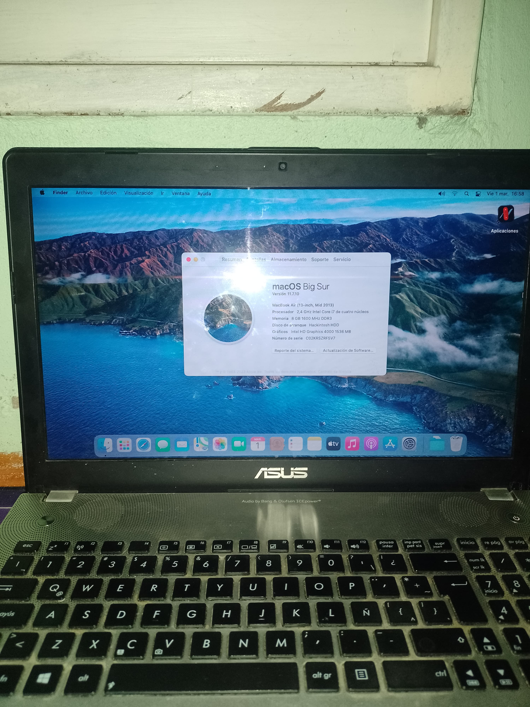

<h1 align="center">
   ASUS N56VB Hackintosh 
</h1>

    

Configuration files, that allow me to run macOS on my laptop. Based on [OpenCore](https://github.com/acidanthera/OpenCorePkg).

- OpenCore [0.9.8](https://github.com/acidanthera/OpenCorePkg/releases/tag/0.9.8)
- macOS Big Sur 11.7.10

---

### **¡Disclaimer!**

The files are meant for my personal reference. I've also modified my laptop firmware which can potentially cause the laptop to become unaccessible.
 You are free to use and modify these files, but do so at your own risk 
Just because this works for me doesn't guarantee it will work for you.

---

I own an _ASUS N56VB_, more specifically:
| Component | Description |
| --------: | :---------- |
| CPU | Intel Core i7 3600QM (Ivy Bridge) |
| iGPU | Intel® HD Graphics 4000 |
| dGPU | Nvidia GeForce GT 740M |
| RAM | 8GB DDR3L 1600MHz |
| HDD | HITACHI HTS545032B9A300 |
| WLAN & BT | ATHEROSAR9485 |
| ETHERNET | ATHEROS8161 |
| AUDIO | ALC663 |

The subwoofer the laptop came with doesn't work and I haven't tried to make it work. I've replaced the optical drive with a hard drive to get more storage space. 
## What is working?

&#9745; Power management  
&#9745; iGPU. (HDMI with audio)  
&#9745; WiFi & Bluetooth  
&#9745; Battery read outs  
&#9745; Sleep  
&#9745; Audio  
&#9745; Touchpad with gestures  
&#9745; FN Keys    
&#9745; USB3.0 Ports  
&#9745; Ethernet port  
&#9745; CFG register unlocked  
&#9745; NVRAM

&#9746; Nvidia dGPU (disabled as switchable graphics are not supported)  
&#9746; External subwoofer

? Card Reader ... _Detected as USB2.0-CRW, but not reading anything_  

- Booting with an external display plugged in turns of the internal display, so during boot I keep any display cables unplugged.

## Special Thanks

[**Apple**](http://apple.com/)

[**Dortania**](https://dortania.github.io/getting-started/)

